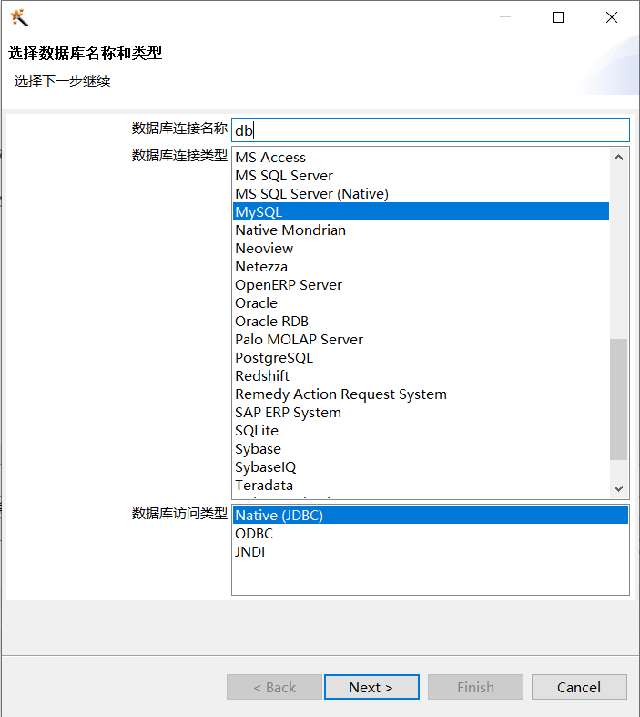
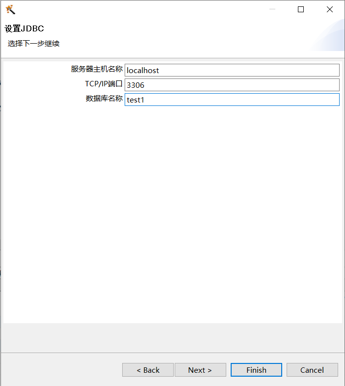
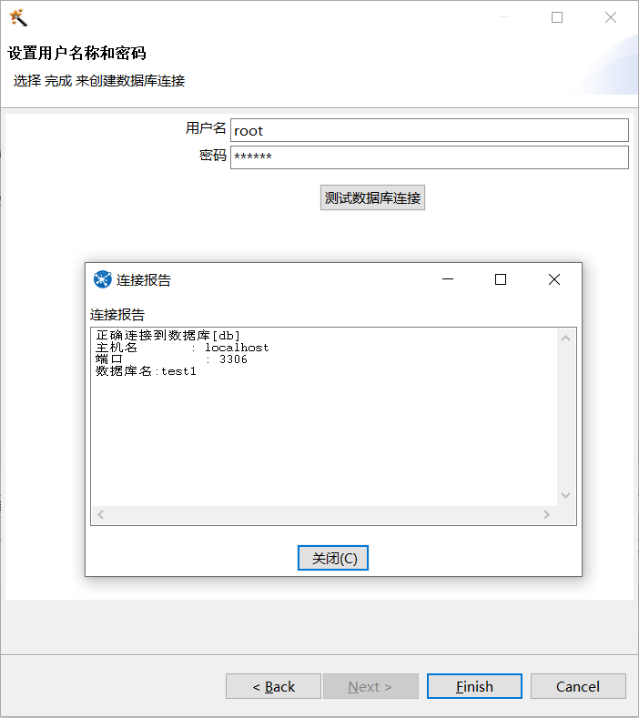

# Kettle（pentaho data integration）笔记

## 环境

- win10
- jdk-13
- kettle pdi-ce-6.1.0.1-196
- mysql-connector-java-5.1.48

## kettle安装配置

1. 安装JDK，添加环境变量，添加完成后可在cmd中输入java、javac进行验证

    ```path
    变量名：JAVA_HOME  变量值：C:\Program Files\Java\jdk-13
    变量名：Path  变量值：%JAVA_HOME%\bin
    ```

2. 下载kettel，可以使用[北理工的镜像](http://mirror.bit.edu.cn/pentaho/Data%20Integration/)
3. 启动kettle：双击kettle目录下的spoon.bat打开软件

### 参考连接

- [Java下载、安装和环境变量的配置](https://www.jianshu.com/p/28af05b521dd)
- [Kettle安装及配置运行环境](https://blog.csdn.net/spurs611/article/details/80916143)
- [kettle的下载、安装和初步使用（windows平台下）（图文详解）](https://www.cnblogs.com/littlehb/p/9253855.html)
- [Pentaho Data Integration(Kettle) 简单上手](https://www.jianshu.com/p/54bd353f226c)

## 使用方法

### kettle连接MySQL的方法

1. 添加mysql的连接驱动，将mysql-connector-java-xxx-bin.jar放到D:\data-integration\lib\安装目录下
2. 在 工具->向导->创建数据库连接向导，创建连接名，类型选择MySQL，访问类型选择Native(JDBC)
    
3. 设置数据库的ip，端口号，数据库名称
    
4. 输入用户名/密码，点击测试数据库连接，出现正确连接到数据库表示连接成功，如果提示错误除了数据库信息输入错误外，多半是MySQL的驱动有问题，需要更换驱动版本
    

### kettle项目结构

- 作业（负责作业调度）
  - 转换1（具体工作内容）
  - 转换2
  - ...
  - 转换n

### 前后台运行与终止

1. 前台运行
   1. ./kitchen -file=workname.kjb
   2. ctrl+c 终止
2. 后台运行
   1. 查看正在运行的命令jps
   2. 后台运行：./kitchen -file=workname.kjb &
   3. 终止运行：kill -9 进程号
