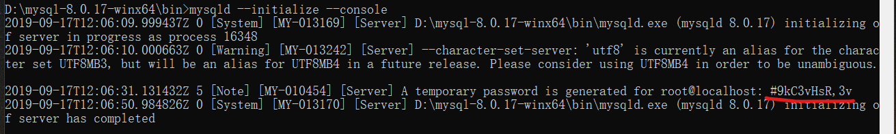
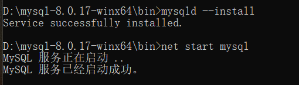
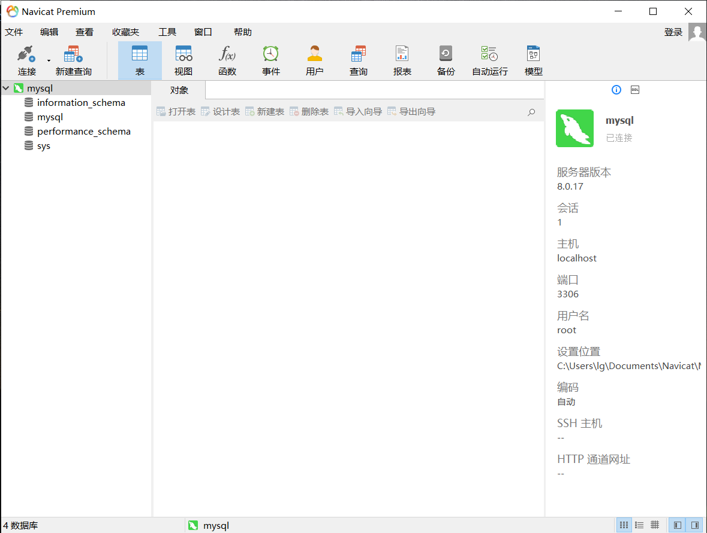

# MySQL笔记

## 安装

1. 下载[MySQL](https://dev.mysql.com/downloads/mysql/)
    

2. 解压文件到安装目录，如D:\mysql-8.0.17-winx64
3. 创建配置文件my.ini

    ```ini
    [mysqld]
    # 设置3306端口
    port=3306
    # 设置mysql的安装目录
    basedir=D:\mysql-8.0.17-winx64
    # 设置mysql数据库的数据的存放目录
    datadir=D:\mysql-8.0.17-winx64\data
    # 允许最大连接数
    max_connections=20
    # 允许连接失败的次数。这是为了防止有人从该主机试图攻击数据库系统
    max_connect_errors=10
    # 服务端使用的字符集默认为UTF8
    character-set-server=utf8
    # 创建新表时将使用的默认存储引擎
    default-storage-engine=INNODB
    # 默认使用“mysql_native_password”插件认证
    default_authentication_plugin=mysql_native_password
    [mysql]
    # 设置mysql客户端默认字符集
    default-character-set=utf8
    [client]
    # 设置mysql客户端连接服务端时默认使用的端口
    port=3306
    default-character-set=utf8

    ```

4. 以管理员身份打开cmd，加载至MySQL安装目录，初始化命令：mysqld --initialize --console

    画横线处为初始密码
    

5. 启动服务，分别执行

   mysqld --install

   mysqld --net start mysql
   

## Navicat可视化工具

1. [安装激活教程](https://www.jianshu.com/p/5f693b4c9468)
2. 连接数据库并修改初始密码
   
