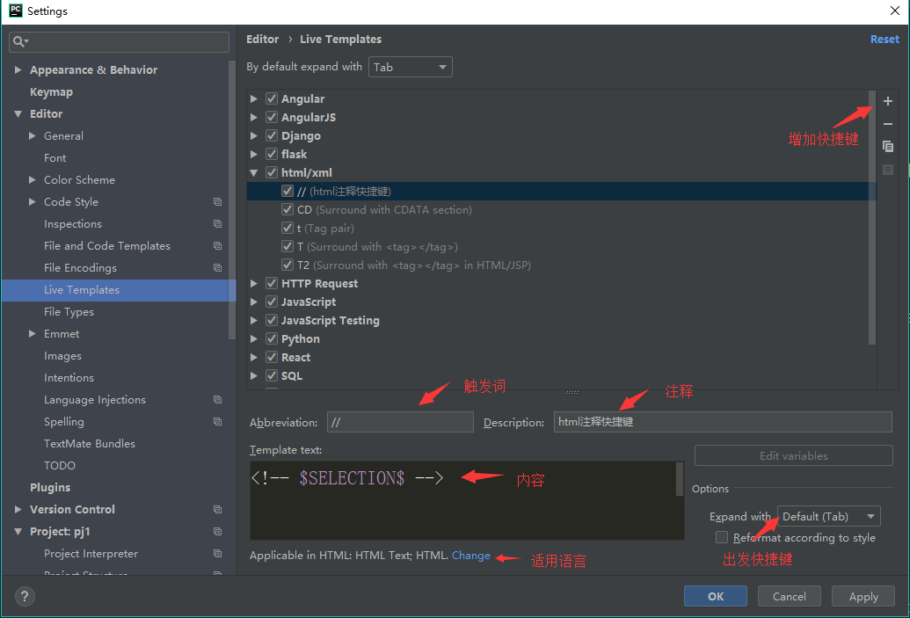

# Pycharm自定义自动补全

## **环境**

- windows10
- pycharm2017.3.3 professional edition

## **方法**

1. 打开File->Settings->Editor->Live Templates

2. 打开需要创建的程序下拉菜单，然后点击右侧“+”号并选择Live Template

3. 编辑自动补全：
    1. 把 \<abbreviation> 修改为触发词
    2. Description为解释内容
    3. 最下面红字，点击后面的Define选择适用语言
    4. 右侧option选择触发按键

4. 点击apply就完成设置。比如下图的设置，在HTML文件里输入`<!`，然后按Tab键就会补全称为`<!-- -->`

