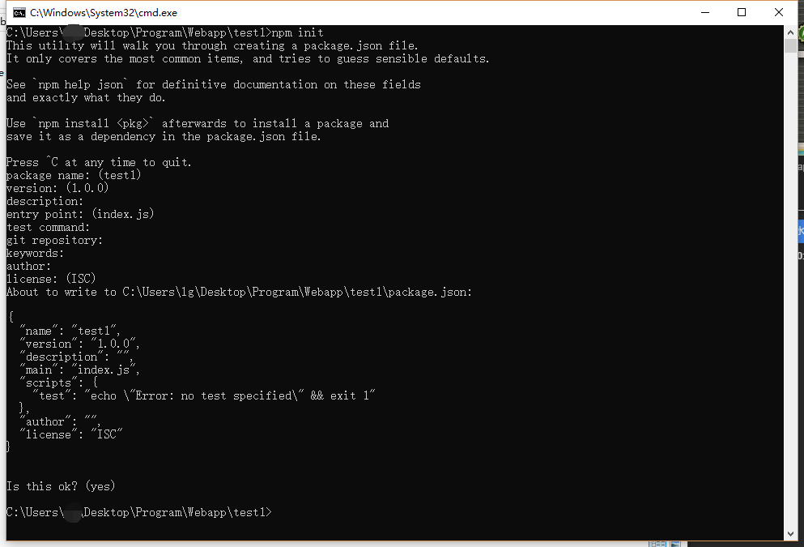
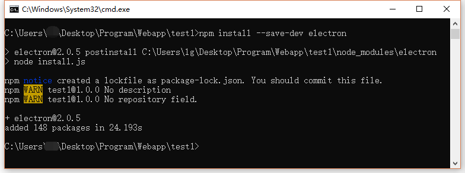

# electron打包web应用流程

## *前言*

Electron（最初名为Atom Shell）是GitHub开发的一个开源框架。 它允许使用Node.js（作为后端）和Chromium（作为前端）完成桌面GUI应用程序的开发。

使用的方法均来自官方文档，能力强的人可根据备注的[官方文档][1]进行操作

## *环境*

- Windows 10
- npm 5.6.0
- node 8.11.3

## *方法*

1. 有一个可以运行的网页程序
2. 创建一个空文件夹
3. 在命令行窗口运行npm init，如图

    

    可以一路回车，生成一个标准的package文件，也可以根据提示进行设定，不过不用担心，生成的package可以随时根据需求更改
4. 生成的package文件如下
    ```json
    {
    "name": "test1",
    "version": "1.0.0",
    "description": "",
    "main": "index.js",
    "scripts": {
        "test": "echo \"Error: no test specified\" && exit 1"
    },
    "author": "",
    "license": "ISC"
    }
    ```
    其中main标签指的是文档开始的文件
    我们需要修改script的内容为
    ```json
    "scripts": {
      "start": "electron ."
    }
    ```
5. 安装electron，同样在命令行执行
    ```cmd
    npm install --save-dev electron
    ```
    国内网络问题，需要配置环境变量为淘宝npm，负责速度极慢或出错，方法自行查找
    ```cmd
    ELECTRON_MIRROR="https://npm.taobao.org/mirrors/electron/"
    ```
    安装结果如图

    
6. 此时文件内会多出一个node_modules文件夹和package-lock文件，我们需要创建一个index.js文件，内容如下：
    ```js
    const {app, BrowserWindow} = require('electron')
  
    // Keep a global reference of the window object, if you don't, the window will
    // be closed automatically when the JavaScript object is garbage collected.
    let win

    function createWindow () {
        // 创建浏览器窗口。
        win = new BrowserWindow({width: 800, height: 600})

        // 然后加载应用的 index.html。
        win.loadFile('index.html')

        // 打开开发者工具
        win.webContents.openDevTools()

        // 当 window 被关闭，这个事件会被触发。
        win.on('closed', () => {
        // 取消引用 window 对象，如果你的应用支持多窗口的话，
        // 通常会把多个 window 对象存放在一个数组里面，
        // 与此同时，你应该删除相应的元素。
        win = null
        })
    }

    // Electron 会在初始化后并准备
    // 创建浏览器窗口时，调用这个函数。
    // 部分 API 在 ready 事件触发后才能使用。
    app.on('ready', createWindow)

    // 当全部窗口关闭时退出。
    app.on('window-all-closed', () => {
        // 在 macOS 上，除非用户用 Cmd + Q 确定地退出，
        // 否则绝大部分应用及其菜单栏会保持激活。
        if (process.platform !== 'darwin') {
        app.quit()
        }
    })

    app.on('activate', () => {
        // 在macOS上，当单击dock图标并且没有其他窗口打开时，
        // 通常在应用程序中重新创建一个窗口。
        if (win === null) {
        createWindow()
        }
    })

    // 在这个文件中，你可以续写应用剩下主进程代码。
    // 也可以拆分成几个文件，然后用 require 导入。`
    ```
7. 导入或创建HTML项目到文件夹下，起始页面为index.html，项目文件如下图所示，style.css是html文件的样式，非必须

    
8. 运行项目，在控制台执行，就可以运行项目
    ```cmd
    npm start
    ```
9. 项目打包，生成exe文件，只介绍其中一种方法，另一种大致相似，可以参考官方文档
    1. 创建一个新的文件夹用于存放新内容
    2. 拷贝之前文件夹内node_modules>electron>dist文件夹内全部内容到新的文件夹
    3. 在新文件夹>resources目录下创建一个名为app的文件夹，拷贝之前文件夹内除node_modules外所有文件到app文件夹内
    4. 运行新文件夹下的electron.exe文件即可运行，这个文件也可以改成任意的名字

10. 修改exe文件，编辑icon等其他信息，官方推荐使用[rcedit](https://github.com/electron/rcedit)

## *备注*

- [electron官方文档][1]
- [官方文档——打造你第一个 Electron 应用](https://electronjs.org/docs/tutorial/first-app)
- [官方文档——分发应用](https://electronjs.org/docs/tutorial/application-distribution)
- [官方文档——应用程序打包](https://electronjs.org/docs/tutorial/application-packaging)

[1]:https://electronjs.org/docs
