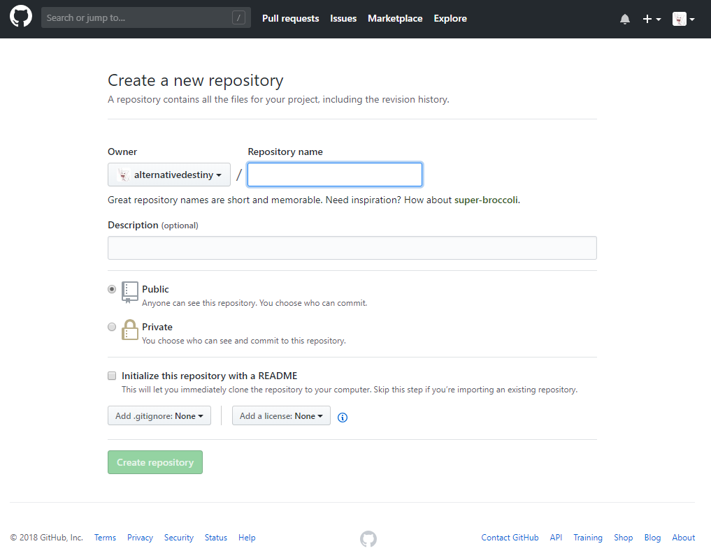
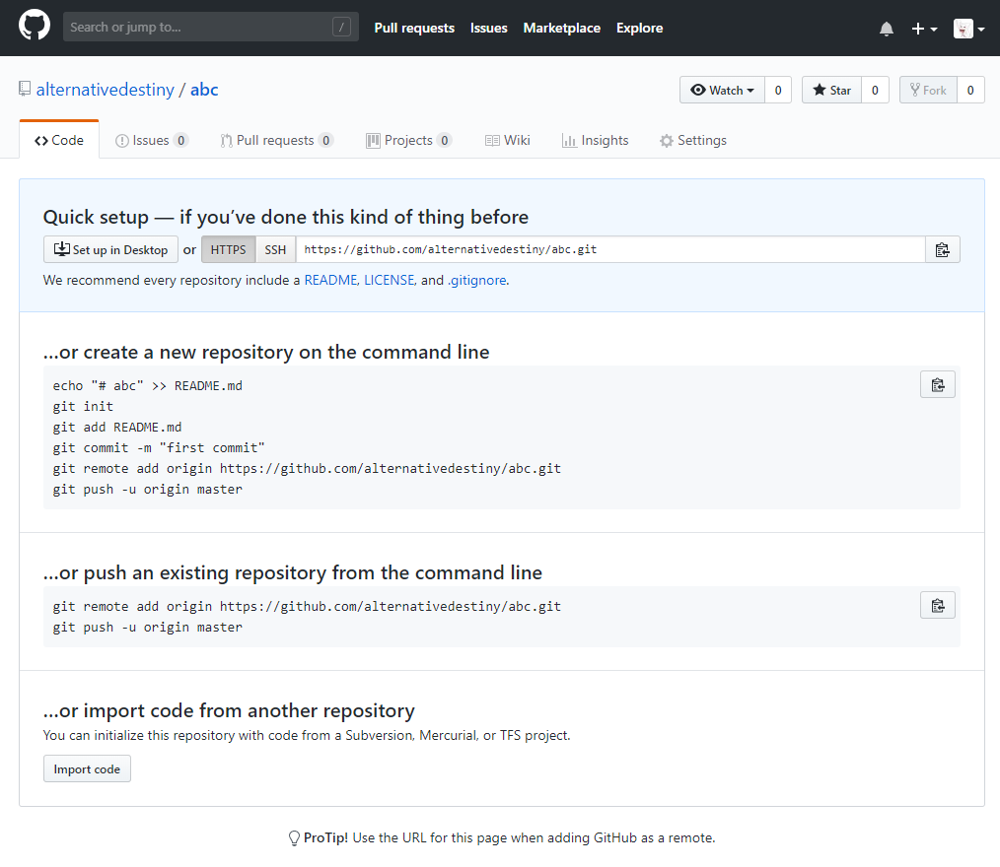

# 使用Git 工具将本地文件上传到Github

## 前言

这部分内容需要先注册github账户，学习github指令

## 环境

- Windows 10

## 方法

1. 打开Github网站，登陆账户，点击头像旁边的加号，选择“New repository”创建一个新的工程。
2. 创建好工程后会跳转到工程页面，其实此时的页面里面就清楚写着上传项目的方法，不过第一次用并不知道这堆英文是什么意思，不过网上有部分教程可能是因为太老了，指令不正确，此时按照这个页面上操作肯定是不会有什么问题。
3. 创建一个文件夹，把要上传的文件放到该文件夹里，比如创建一个readme.txt文件，然后右键点击“Git Bash Here”弹出一个命令框，按照下面指令一步一步操作。# 后是注释，不要输入！
    ```git
    git init  # 初始化Git
    git add readme.txt  # 添加文件，注意替换文件名
    git commit -m "注释"  # 文件入库
    git remote add origin https://github.com/alternativedestiny/DataShowWebsite.git  # 链接之前在Github上面创建的工程，注意更换地址
    git push -u origin master  # 上传项目文件，第一次会出现一个登陆窗口，需要登陆你的Github账户，之后就不会出现了。登陆之后出现下面这些文字表示上传成功
    ```

## 备注

- origin 添加错误或需要更换origin执行下面指令，删除原有origin，然后重新添加就行
    ```git
    git remote rm origin
    ```